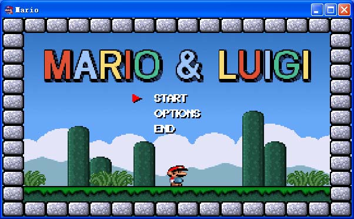

# MarioRS

将 Mike Wiering 的 Turbo Pascal 马里奥克隆游戏移植到 Rust。



> **原版官网**: [Wiering Software - Mario](https://wieringsoftware.nl/mario/) | [源码下载](https://wieringsoftware.nl/mario/source.html)

> **学习文档**: [wgpu游戏开发学习指南](docs/WGPU_LEARNING_GUIDE.md) - 从零开始学习本项目的GPU渲染实现

## 特性

- 完整移植原版 6 个关卡
- 双人轮流模式（Mario 和 Luigi）
- 多平台支持：Windows / Linux / macOS / Android
- **双渲染后端架构**：
  - **wgpu GPU 渲染**（默认）：跨平台硬件加速，支持 Vulkan/Metal/DirectX 12
  - **CPU 软件渲染**：纯软件渲染，兼容 Windows XP 等老旧系统
- **手柄支持**：Windows 和 Android 平台支持 USB/蓝牙手柄
- **Android TV 遥控器支持**：支持使用 Android TV 遥控器控制游戏
- **Android GPU 自动降级**：GPU 初始化失败时自动切换到 CPU 渲染
- Windows 7/XP 兼容版本（使用 CPU 后端 + YY-Thunks）
- Android 原生支持（触摸屏虚拟按键）
- 窗口缩放和全屏支持
- 暗黑主题自动适配（Windows 10+）

## 游戏控制

### 键盘控制

| 按键 | 功能 |
|------|------|
| `←` `→` | 左右移动 |
| `↑` | 进入管道 |
| `↓` | 从管道出来 |
| `Alt` | 跳跃（按住可控制跳跃高度）|
| `Ctrl` | 加速/跑步 |
| `空格` | 发射火球（火焰马里奥状态）|

### 快捷键

| 按键 | 功能 |
|------|------|
| `P` | 暂停游戏 |
| `S` | 切换状态栏显示 |
| `F11` | 切换全屏/窗口模式 |
| `ESC` | 退出全屏/退出游戏/返回上级菜单 |

### 手柄控制

支持 Windows 和 Android 平台的 USB/蓝牙手柄。手柄连接后自动检测。

| 按键 | 功能 |
|------|------|
| 左摇杆/D-Pad | 方向移动 |
| A / B | 跳跃 |
| LB / RB | 加速/跑步 |
| X | 发射火球 |
| START | 开始/暂停 |
| SELECT | 返回 |

**手柄按钮映射:**
- **跳跃**: A 或 B 按钮
- **加速**: LB 或 RB 肩键
- **发射**: X 按钮

### Android TV 遥控器

支持使用 Android TV 遥控器控制游戏，适合在电视上游玩。

| 按键 | 功能 |
|------|------|
| 上 | 菜单向上/发射子弹 |
| 下 | 菜单向下/进入管道 |
| 左 | 左移动 |
| 右 | 右移动 |
| OK (确认) | 菜单确认/跳跃 |
| 返回 | 返回上级菜单 |

**遥控器特性:**
- 自动加速模式：检测到遥控器时自动开启加速
- 空中慢动作：跳跃后空中停留时间延长，便于单键操作

### Android 触摸控制

Android 版本使用原生 Android 按钮实现虚拟控制界面，解决了多点触摸延迟问题。

**游戏控制按钮（屏幕下方）**：

| 控件 | 功能 | 对应按键 |
|------|------|----------|
| D-Pad (左下角) | 方向控制；左键可返回上级菜单 | 方向键 |
| A 按钮 (右下角) | 跳跃；菜单确认 | Alt |
| B 按钮 | 加速/跑步 | Ctrl |
| X 按钮 | 发射火球 | 空格 |
| Y 按钮 | 备用功能 | Shift |

**功能按钮（右上角）**：

| 按钮 | 功能 |
|------|------|
| H | 隐藏/显示游戏控制按钮 |
| E | 进入/退出布局编辑模式 |
| KB | 打开/关闭虚拟键盘（输入作弊码）|

**菜单操作**：
- **确认选择**: 点击 A 按钮
- **返回上级**: 点击 D-Pad 左键

**布局编辑模式**：点击右上角 E 按钮进入编辑模式，可拖拽调整虚拟按键位置。调整完成后再次点击 E 按钮退出并保存布局。

**虚拟键盘**：点击 KB 按钮打开虚拟键盘面板，用于输入作弊码。键盘面板可拖动调整位置。

**输入设备自动切换**：
- 检测到手柄或遥控器输入时自动隐藏虚拟按钮
- 手柄和遥控器可与触摸控制同时使用

### 菜单结构

```
主菜单 (MENU)
├── START (开始游戏)
│   ├── NO SAVE      - 不保存进度开始新游戏
│   ├── GAME SELECT  - 选择存档槽位 (1/2/3)
│   └── ERASE        - 删除存档
├── OPTIONS (选项)
│   ├── SOUND ON/OFF     - 音效开关
│   └── STATUSLINE ON/OFF - 状态栏开关
└── END (退出游戏)
```

## 编译运行

### 环境要求

- Rust 1.85+ (Edition 2024)
- Windows: Visual Studio Build Tools (MSVC)
- Linux/macOS: 标准开发工具链

### Windows 编译

#### 默认版本（wgpu GPU 渲染，Windows 10+ 推荐）

```powershell
cargo build --release
# 或使用脚本
.\build_release.ps1
```

默认使用 wgpu GPU 渲染后端，需要支持 Vulkan/DirectX 12 的显卡。

#### Windows 7/XP 兼容版本（CPU 软件渲染）

```powershell
.\build_win7xp.ps1           # 64位
.\build_win7xp.ps1 -Arch x86 # 32位
```

此版本使用 CPU 软件渲染后端，通过 GDI StretchDIBits 显示，无需 GPU 支持，兼容 Windows XP SP3 及以上系统。

详见 [build_win7xp.md](build_win7xp.md)

### Linux/macOS 编译

```bash
cargo build --release
```

Linux/macOS 默认使用 wgpu 后端进行 GPU 渲染。

### Android 编译

#### 环境要求

- Rust 工具链
- Android SDK（设置 `ANDROID_HOME` 或 `ANDROID_SDK_ROOT` 环境变量）
- Android NDK（设置 `ANDROID_NDK_HOME` 或通过 SDK Manager 安装）
- JDK 17+
- cargo-ndk（脚本会自动安装）

#### 使用构建脚本

```powershell
# 构建 Debug APK (仅 arm64 架构)
.\build_android.ps1

# 构建 Release APK (仅 arm64 架构)
.\build_android.ps1 -Release

# 构建所有架构合并的 APK
.\build_android.ps1 -AllArch

# 构建三个独立 APK (每个架构一个)
.\build_android.ps1 -SeparateApks

# 构建 Release + 三个独立 APK
.\build_android.ps1 -Release -SeparateApks

# 仅构建 APK (跳过 Rust 编译)
.\build_android.ps1 -SkipRust

# 显示帮助信息
.\build_android.ps1 -Help
```

#### 脚本参数说明

| 参数 | 说明 |
|------|------|
| `-Release` | 构建 Release 版本（默认 Debug）|
| `-AllArch` | 编译所有架构合并到一个 APK |
| `-SeparateApks` | 为每个架构生成独立的 APK |
| `-SkipRust` | 跳过 Rust 编译，仅执行 Gradle 构建 |
| `-Help` | 显示详细帮助信息 |

#### 构建流程

1. **环境检查**：验证 Rust、Android SDK、NDK、JDK 是否正确安装
2. **工具安装**：自动安装 cargo-ndk 和添加 Android Rust targets
3. **编译 Rust**：使用 cargo-ndk 编译生成 .so 动态库
4. **复制依赖**：复制 libc++_shared.so 到 jniLibs 目录
5. **构建 APK**：调用 Gradle 生成最终 APK 文件

#### 输出文件

所有 APK 输出到 `dist/android/` 目录：

**单一 APK 模式**（默认或 `-AllArch`）：

| 文件 | 说明 |
|------|------|
| `dist/android/app-debug-arm64.apk` | Debug 版本 (ARM64 only) |
| `dist/android/app-release-arm64.apk` | Release 版本 (ARM64 only) |
| `dist/android/app-release-universal.apk` | Release 版本 (所有架构) |

**独立 APK 模式**（`-SeparateApks`）：

| 文件 | 架构 | 适用设备 |
|------|------|----------|
| `dist/android/app-release-arm64-v8a.apk` | ARM 64位 | 现代手机（推荐）|
| `dist/android/app-release-armeabi-v7a.apk` | ARM 32位 | 老旧手机 |
| `dist/android/app-release-x86_64.apk` | x86 64位 | 模拟器/Chromebook |

#### 安装到设备

```bash
# 安装 ARM64 版本 (推荐)
adb install -r dist/android/app-release-arm64.apk

# 安装独立 APK (根据设备架构选择)
adb install -r dist/android/app-release-arm64-v8a.apk
```

### 运行

```bash
# Windows/Linux/macOS (wgpu GPU 渲染，默认)
cargo run --release

# Windows XP 兼容模式 (CPU 软件渲染)
cargo run --release --features cpu-backend --no-default-features
```

## 项目结构

```
MarioRS/
├── src/
│   ├── main.rs           # 程序入口
│   ├── lib.rs            # 库入口
│   ├── mario.rs          # 游戏状态机
│   ├── game_runner.rs    # 游戏主运行器
│   ├── context.rs        # 游戏上下文
│   ├── play.rs           # 主游戏逻辑
│   ├── players.rs        # 玩家行为 (Mario/Luigi)
│   ├── enemies.rs        # 敌人系统
│   ├── figures.rs        # 游戏物体行为
│   ├── joystick.rs       # 手柄状态管理器
│   ├── renderer.rs       # 统一渲染管线
│   ├── render_state.rs   # 渲染状态管理
│   ├── backgr.rs         # 背景绘制
│   ├── sprites.rs        # 精灵数据
│   ├── sprite_assets.rs  # 精灵资源管理
│   ├── palettes.rs       # 调色板管理
│   ├── keyboard.rs       # 键盘输入
│   ├── music.rs          # 音效系统
│   ├── txt.rs            # 文本渲染
│   ├── config.rs         # 配置管理
│   ├── persist.rs        # 持久化工具
│   │
│   ├── gpu/              # GPU 渲染模块 (wgpu)
│   │   ├── mod.rs        # 模块入口
│   │   ├── renderer.rs   # GPU 渲染器核心
│   │   ├── pipeline.rs   # 渲染管线创建
│   │   ├── buffer_pool.rs # GPU 缓冲区池
│   │   ├── sprite_batch.rs # 精灵批处理
│   │   ├── texture_atlas.rs # 纹理图集
│   │   ├── tilemap.rs    # 地图块渲染
│   │   ├── palette.rs    # 调色板管理
│   │   ├── types.rs      # 渲染数据类型
│   │   └── shaders/      # WGSL 着色器
│   │       ├── sprite.wgsl  # 精灵着色器
│   │       ├── fill.wgsl    # 填充着色器
│   │       ├── scale.wgsl   # 缩放着色器
│   │       └── overlay.wgsl # 叠加层着色器
│   │
│   ├── cpu/              # CPU 软件渲染模块
│   │   ├── mod.rs        # 模块入口
│   │   └── renderer.rs   # CPU 软件渲染器
│   │
│   ├── worlds/           # 关卡数据
│   │   ├── intro.rs      # 开场动画
│   │   └── level_*.rs    # 关卡 1-6
│   │
│   └── platform/         # 平台抽象层
│       ├── mod.rs        # 平台 trait 定义
│       ├── windows.rs    # Windows wgpu + GDI 后端
│       ├── windows_cpu.rs # Windows CPU 软件渲染后端 (XP 兼容)
│       ├── desktop.rs    # 跨平台 wgpu 后端 (Linux/macOS)
│       ├── android.rs    # Android 原生后端 (JNI + GPU/CPU 自动切换)
│       ├── joystick_win.rs     # Windows 手柄后端 (winmm.dll)
│       ├── joystick_android.rs # Android 手柄后端 (USB/蓝牙)
│       ├── joystick_android_tv.rs # Android TV 遥控器后端
│       ├── common/       # 公共平台实现
│       │   ├── frame_timer.rs # 帧率控制
│       │   ├── input.rs      # 输入处理
│       │   ├── random.rs     # 随机数生成
│       │   ├── storage.rs    # 持久化存储
│       │   └── time.rs       # 时间管理
│       └── audio/        # 音频后端
│           ├── waveout.rs    # Windows WaveOut
│           ├── cpal_audio.rs # 跨平台 cpal
│           └── web_audio.rs  # Web Audio (占位)
│
├── android/              # Android 项目
│   ├── app/
│   │   ├── src/main/
│   │   │   ├── java/com/mariogame/mario/
│   │   │   │   ├── MainActivity.java     # 主活动 + JNI 接口
│   │   │   │   ├── GamepadController.java # 手柄控制器
│   │   │   │   ├── RemoteController.java  # 遥控器控制器
│   │   │   │   └── VirtualController.java # 虚拟按钮控制器
│   │   │   ├── res/
│   │   │   │   ├── layout/       # 按钮布局 XML
│   │   │   │   ├── drawable/     # 按钮背景资源
│   │   │   │   └── values/       # 样式和尺寸
│   │   │   ├── jniLibs/      # 编译生成的 .so 文件
│   │   │   └── AndroidManifest.xml
│   │   └── build.gradle.kts
│   └── build.gradle.kts
├── assets/
│   ├── sprites/          # 精灵数据文件
│   ├── *.BK              # 背景数据
│   └── mario.ico         # 应用图标
├── examples/
│   ├── create_icon.rs    # 图标生成工具
│   └── export_sprites.rs # 精灵导出工具
├── build_android.ps1     # Android 构建脚本
└── build.rs              # 构建脚本
```

## 渲染架构

MarioRS 采用双渲染后端架构，支持现代 GPU 加速渲染和传统 CPU 软件渲染。

### GPU 渲染后端 (wgpu)

- 使用 wgpu 进行跨平台 GPU 硬件加速渲染
- 支持 Vulkan (Linux/Windows/Android)、Metal (macOS)、DirectX 12 (Windows)
- 精灵批处理、纹理图集、WGSL 着色器
- 渲染管线：Sprite -> Fill -> Scale -> Overlay

### CPU 软件渲染后端

- 纯 CPU 软件渲染，无 GPU 依赖
- Windows: 通过 GDI StretchDIBits 显示帧缓冲
- Android: 通过 ANativeWindow API 直接写入帧缓冲
- 兼容老旧系统 (Windows XP, 不支持 Vulkan 的 Android 设备)
- 支持索引色精灵、调色板、翻转、透明等效果

### Android GPU 自动降级

Android 平台采用智能渲染策略：

- 优先使用 Vulkan GPU 渲染
- GPU 初始化失败时自动切换到 CPU 软件渲染
- 确保在各种 Android 设备上都能运行
- 支持整数缩放保持像素清晰

## 构建选项

| Feature | 说明 | 平台 |
|---------|------|------|
| `wgpu-backend` | wgpu GPU 硬件加速渲染 | Windows/Linux/macOS/Android |
| `cpu-backend` | CPU 软件渲染（XP 兼容）| Windows |
| `gdi-backend` | Windows GDI 窗口创建 | Windows |
| `android` | Android 原生渲染（GPU + CPU 自动降级）| Android |
| `touch-panel` | 触摸控制面板 | Android |
| `dark-theme` | 暗黑主题适配 | Windows 10+ |

**默认**: `wgpu-backend` + `dark-theme`

### Feature 组合说明

| 场景 | Features | 说明 |
|------|----------|------|
| Windows 现代版（推荐）| `wgpu-backend`, `gdi-backend`, `dark-theme` | GPU 渲染 + GDI 窗口 |
| Windows XP 兼容 | `cpu-backend` | CPU 软件渲染 + GDI 窗口 |
| Linux/macOS | `wgpu-backend` | GPU 渲染 + winit 窗口 |
| Android | `android` | GPU 渲染 + CPU 自动降级 + 手柄/遥控器支持 |

## 平台支持

| 平台 | 渲染后端 | 音频 | 输入设备 | 最低版本 |
|------|----------|----------|----------|----------|
| Windows 10/11 | wgpu (GPU) | WaveOut | 键盘 + 手柄 | 默认支持 |
| Windows 7/8 | CPU 软件渲染 + YY-Thunks | WaveOut | 键盘 + 手柄 | 需使用兼容版本 |
| Windows XP | CPU 软件渲染 + YY-Thunks | WaveOut | 键盘 + 手柄 | 需使用兼容版本 |
| Linux | wgpu (GPU) | cpal | 键盘 | 默认支持 |
| macOS | wgpu (GPU) | cpal | 键盘 | 默认支持 |
| Android | wgpu (GPU) + CPU Fallback | cpal | 触摸 + 手柄 + 遥控器 | API 24+ |
| Android TV | wgpu (GPU) + CPU Fallback | cpal | 遥控器 + 手柄 | API 24+ |

### 手柄支持详情

| 平台 | 后端 | 支持的手柄 |
|------|----------|----------|
| Windows | winmm.dll (Multimedia API) | 任何在 joy.cpl 中显示的 USB/蓝牙手柄 |
| Android | Java InputDevice API | USB/蓝牙手柄 |

### Android TV 遥控器支持详情

- 独立的遥控器处理模块，与手柄逻辑完全分离
- 通过 DPAD_CENTER (OK键) 检测真正的TV遥控器
- 自动加速模式，便于单手操作
- 支持空中慢动作，便于精确控制

## 关卡

游戏包含 6 个关卡，通关后解锁 Turbo 模式（敌人速度加快）。

1. **Level 1** - 经典地上关卡（草地）
2. **Level 2** - 地下水道关卡
3. **Level 3** - 高空关卡（云层）
4. **Level 4** - 城堡关卡（熔岩）
5. **Level 5** - 雪地关卡
6. **Level 6** - 最终关卡

## 作弊码

在游戏中按 `P` 暂停，然后按 `Tab` 进入作弊码输入模式。

| 作弊码 | 效果 |
|--------|------|
| `1UP` | 生成 1UP 蘑菇 |
| `F1F2` | 获得蘑菇（变大）|
| `FFB5` | 获得火焰花 |
| `9C32` | 获得无敌星星 |
| `03E8` | 增加一条生命 |
| `2305` | 直接通关当前关卡 |
| `D235` | 切换 Turbo 模式 |
| `MONO` | 黑白模式 |
| `VGAMODE` | 恢复正常颜色 |

## 致谢

- 原版 Pascal 游戏作者: **Mike Wiering** (1994-95)
- YY-Thunks: [Chuyu-Team](https://github.com/Chuyu-Team/YY-Thunks)
- 参考文章: [Programming Nostalgia: revisiting Mike Wiering's Mario](https://www.codeproject.com/Articles/5360383/Programming-Nostalgia-revisiting-Mike-Wiering-s-Ma)

## 许可证

参见 [LICENSE](LICENSE) 文件。
