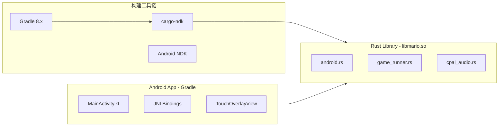

# MarioRS Android 平台移植方案

## 一、架构概览



## 二、需要创建/修改的文件

### 1. Rust 代码改动

**[`src/platform/android.rs`](src/platform/android.rs)** - 新建 Android 平台实现

核心实现内容：

- `AndroidDisplay` - 使用 wgpu + android-activity 渲染
- `AndroidInput` - 处理触摸事件和物理按键
- `AndroidStorage` - 使用 Android Internal Storage
- `AndroidLog` - 使用 android_logger
- 复用 `cpal_audio.rs` 作为音频后端
- 虚拟按钮状态管理和触摸区域检测

关键代码结构：

```rust
// 触摸虚拟按钮区域定义
pub struct VirtualButtons {
    dpad_center: (f32, f32),
    dpad_radius: f32,
    jump_button: (f32, f32, f32), // x, y, radius
    // 触摸状态追踪
    active_touches: HashMap<i32, TouchState>,
}

// Android 输入后端 - 支持触摸和物理键盘
pub struct AndroidInput {
    key_states: HashSet<PlatformKeyCode>,
    virtual_buttons: VirtualButtons,
    has_physical_keyboard: bool,
}
```

**[`src/platform/mod.rs`](src/platform/mod.rs)** - 添加 Android 条件编译

```rust
#[cfg(target_os = "android")]
mod android;

#[cfg(target_os = "android")]
pub use self::android::{
    random_i32, random_usize, random_u32, random_u8, random_f32,
    now_ms, log_debug, log_info, log_warn, log_error,
    AndroidStorage as DesktopStorage,
    // ... 其他导出
};
```

**[`src/platform/audio/mod.rs`](src/platform/audio/mod.rs)** - 确认 Android 使用 cpal

```rust
// Android 使用 cpal (已在 cfg(not(target_os = "windows")) 中支持)
#[cfg(target_os = "android")]
pub type PlatformAudio = CpalAudio;
```

**[`src/lib.rs`](src/lib.rs)** - 添加 Android 入口点

```rust
#[cfg(target_os = "android")]
pub use platform::android_main;
```

**[`Cargo.toml`](Cargo.toml)** - 添加 Android 依赖

```toml
[lib]
crate-type = ["cdylib", "rlib"]  # 支持动态库输出

[target.'cfg(target_os = "android")'.dependencies]
android-activity = { version = "0.6", features = ["native-activity"] }
android_logger = "0.14"
log = "0.4"
ndk = "0.9"

[features]
android = ["dep:android-activity", "dep:android_logger", "dep:log", "dep:ndk"]
```

### 2. Android 项目结构 (新建)

```
android/
├── app/
│   ├── build.gradle.kts
│   ├── src/main/
│   │   ├── AndroidManifest.xml
│   │   ├── kotlin/com/mariogame/
│   │   │   └── MainActivity.kt         # 可选的启动 Activity
│   │   ├── res/
│   │   │   ├── drawable/
│   │   │   │   └── ic_launcher.png     # 游戏图标
│   │   │   ├── layout/
│   │   │   │   └── activity_main.xml   # 触摸覆盖层布局
│   │   │   └── values/
│   │   │       └── strings.xml
│   │   └── jniLibs/                    # cargo-ndk 输出目录
│   │       ├── arm64-v8a/libmario.so
│   │       ├── armeabi-v7a/libmario.so
│   │       └── x86_64/libmario.so
├── build.gradle.kts
├── gradle.properties
├── settings.gradle.kts
└── gradle/wrapper/
```

**`android/app/src/main/AndroidManifest.xml`**

```xml
<manifest xmlns:android="http://schemas.android.com/apk/res/android">
    <application
        android:label="Mario"
        android:icon="@drawable/ic_launcher"
        android:hasCode="false">  <!-- 纯 Native Activity -->
        <activity
            android:name="android.app.NativeActivity"
            android:configChanges="orientation|screenSize|keyboardHidden"
            android:screenOrientation="landscape"
            android:exported="true">
            <meta-data
                android:name="android.app.lib_name"
                android:value="mario" />
            <intent-filter>
                <action android:name="android.intent.action.MAIN" />
                <category android:name="android.intent.category.LAUNCHER" />
            </intent-filter>
        </activity>
    </application>
</manifest>
```

### 3. 构建脚本

**[`build_android.ps1`](build_android.ps1)** - Windows PowerShell 构建脚本

```powershell
# 主要步骤:
# 1. 检查/安装 cargo-ndk
# 2. 设置 ANDROID_NDK_HOME 环境变量
# 3. 编译多架构 .so 文件 (arm64-v8a, armeabi-v7a, x86_64)
# 4. 复制到 android/app/src/main/jniLibs/
# 5. 调用 gradlew assembleRelease 生成 APK
```

**[`build_android.sh`](build_android.sh)** - Linux/macOS 构建脚本 (可选)

## 三、虚拟按钮实现细节

在 `android.rs` 中实现触摸输入转换：

```rust
// 屏幕布局 (横屏模式)
// +------------------------------------------+
// |                                          |
// |   [D-Pad]                    [A] [B]     |
// |     /|\                                  |
// |    /-+-\                                 |
// |     \|/                                  |
// +------------------------------------------+

impl VirtualButtons {
    pub fn new(screen_width: f32, screen_height: f32) -> Self {
        Self {
            // D-Pad 在左下角
            dpad_center: (screen_width * 0.15, screen_height * 0.7),
            dpad_radius: screen_height * 0.2,
            // 跳跃按钮在右下角
            jump_button: (screen_width * 0.85, screen_height * 0.7, screen_height * 0.12),
        }
    }
    
    pub fn process_touch(&mut self, x: f32, y: f32, is_down: bool) -> Vec<PlatformKeyEvent> {
        // 检测 D-Pad 方向
        // 检测跳跃按钮
        // 返回对应的按键事件
    }
}
```

## 四、构建环境要求

- Android SDK (API 21+)
- Android NDK r25+ (推荐 r26)
- Rust toolchain + Android targets:
  ```
  rustup target add aarch64-linux-android
  rustup target add armv7-linux-androideabi
  rustup target add x86_64-linux-android
  ```

- cargo-ndk: `cargo install cargo-ndk`
- JDK 17+ (Gradle 8.x 要求)

## 五、实现顺序

按以下顺序实现可以最小化风险，逐步验证：

1. 先创建 `android.rs` 基础框架（无触摸按钮，仅物理键盘）
2. 修改 `Cargo.toml` 和 `mod.rs` 添加 Android 支持
3. 创建 Android 项目结构和构建脚本
4. 测试基础版本能否在模拟器运行
5. 添加虚拟触摸按钮支持
6. 优化和调整 UI 布局